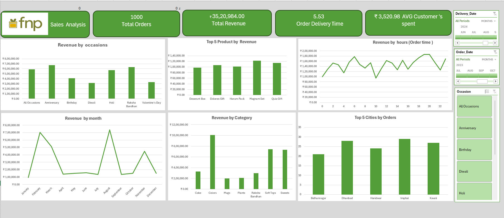

# 📊 FNP Sales Analysis (Excel Dashboard Project)

## 🔹 Project Overview

This project is an interactive Excel dashboard created to analyze sales data of Ferns N Petals (FNP).  
It provides insights into sales performance, customer behavior, and product trends using data visualization techniques.

## 🔹 Objectives

- To analyze overall sales performance  
- To identify top-selling products  
- To track monthly revenue trends  
- To understand customer purchasing patterns  

## 🔹 Tools & Techniques Used

- Microsoft Excel  
- Pivot Tables  
- Pivot Charts  
- Slicers & Filters  
- Data Cleaning  

## 🔹 Key Features

- 📌 Interactive Dashboard  
- 📌 Monthly Revenue Analysis  
- 📌 Top Products Identification  
- 📌 Category-wise Sales Insights  
- 📌 Order Trend Analysis  

## 🔹 Insights Gained

- Certain months show higher sales performance  
- A few products contribute to maximum revenue  
- Customer buying patterns vary over time  

## 🔹 Project Files

- FNP_Sales_Analysis.xlsx  
- fnp-dashboard.png  

## 🔹 Author

**Pragya Malviya**  
📧 pragyamalviya555@gmail.com  
🔗 LinkedIn: https://www.linkedin.com/in/pragya-malviya-727ba7265/  
💻 GitHub: https://github.com/pragyamalviya786  

## 🔹 Conclusion

This dashboard helps in understanding business performance and supports data-driven decision-making.

---

✨ This Excel dashboard project demonstrates data analysis and visualization skills, making it suitable for beginner-level data analyst portfolios.
